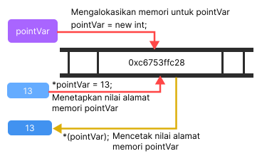

# C++ memory management: new dan delete
##### Di tutorial ini, kita akan belajar untuk mengola memory secara efektif di C++ menggunakan operasi ```new``` dan ```delete```
C++ mengizinkan kita untuk mengalokasikan memori dari sebuah variabel atau sebuah array di run time (Run time adalah fase program komputer dimana program dijalankan atau dieksekusi pada sistem komputer.). Ini dikenal sebagai dynamic memory allocation.

Di bahasa pemrogramman lain seperti Java dan Python, compiler secara otomatis mengelola memori yang dialokasikan ke variabel, tapi ini tidak terjadi di C++.

Di C++, kita perlu membatalkan alokasi memori yang dialokasikan secara dinamis secara manual setelah kita tidak menggunakan variabel tersebut.

Kita dapat mengalokasikan dan kemudian membatalkan alokasi memori secara dinamis menggunakan masing-masing operator ```new``` dan ```delete```.

##### C++ ```new``` Operator
Operator ```new```  digunakan untuk mengalokasikan memori ke dalam sebuah variabel, sebagai contoh :
```
#include <iostream>
using namespace std;

int main() {
    // Deklarasi pointer pointVar
    int * pointVar;
    
    // Mengalokasikan memori pointVar
    pointVar = new int;

    // Mencetak nilai alamat memori pointVar
    cout << *(pointVar) << endl;

    // Menetapkan nilai alamat memori pointVar
    *pointVar = 13;

    // Mencetak nilai alamat memori pointVar
    cout << *(pointVar) << endl;

    return 0;
}
```
Di sini, kami telah mengalokasikan memori secara dinamis untuk variabel int menggunakan operator new.

Perhatikan bahwa kita telah menggunakan pointer pointVar untuk mengalokasikan memori secara dinamis. Ini karena operator ```new``` mengembalikan alamat lokasi memori.

Dalam kasus array, operator ```new``` mengembalikan alamat elemen pertama array.

Dari contoh di atas, kita dapat melihat bahwa sintaks untuk menggunakan operator baru adalah:
```pointerVariable = new dataType;```

##### ```delete``` operator
Sekalinya kita sudah tidak butuh untuk menggunakan sebuah variabel yang kita deklarasikan secara dinamis, kita bisa membatalkan alokasi memori yang ditempati oleh variabel.
Maka dari itu, operator ```delete``` digunakan, ini mengembalikan memori ke sistem operasi ini dikenal sebagai **dealokasi memori**.
Syntax untuk operator ini adalah:
```
delete pointerVariable'
```

```
 // Deklarasi pointer pointVar
    int * pointVar;

    // Mengalokasikan memori untuk poinVar variabel int
    pointVar = new int;

    // Mencetak nilai alamat pointVar
    cout << *(pointVar) << " : " << &pointVar << endl;

    // Menetapkan nilai alamat pointVar
    *pointVar = 13;

    // Mencetak nilai alamat pointVar
    cout << *(pointVar) << " : " << &pointVar << endl;

    // Menghapus memori yang dialokasikan
    delete pointVar;

    // Mencetak nilai alamat pointVar
    cout << *(pointVar) << " : " << &pointVar << endl;
```
Perhatikan bahwa setelah kita mencetak pointVar, kita membatalkan alokasi memori pointVar
**Catatan:** Jika program menggunakan sejumlah besar memori yang tidak diinginkan dengan menggunakan yang baru, sistem mungkin macet karena tidak akan ada memori yang tersedia untuk sistem operasi. Dalam hal ini, operator delete dapat membantu sistem dari crash.

```
// Deklarasi pointer int
    int * pointInt;

    // Deklarasi pointer float
    float * pointFloat;

    // Mengalokasikan memori secara dinamis
    // untuk pointer int dan float
    pointInt = new int;
    pointFloat = new float;

    // Menetapkan nilai pada alamat pointer int dan float
    *pointInt = 13;
    *pointFloat = 6;

    // Mencetak nilai alamat pointer int dan float
    cout << *pointInt << " : " << &pointInt << "\n";
    cout << *pointFloat << " : " << &pointFloat << "\n";

    // Membatalkan alokasi memori untuk pointer int dan float
    delete pointInt;
    delete pointFloat;
    
    // Mencetak nilai alamat pointer int dan float
    cout << *pointInt << " : " << &pointInt << "\n";
    cout << *pointFloat << " : " << &pointFloat << "\n";
```
**Catatan:** Alokasi memori dinamis dapat membuat manajemen memori lebih efisien. Khusus untuk array, dimana seringkali kita tidak mengetahui ukuran array hingga run time.


