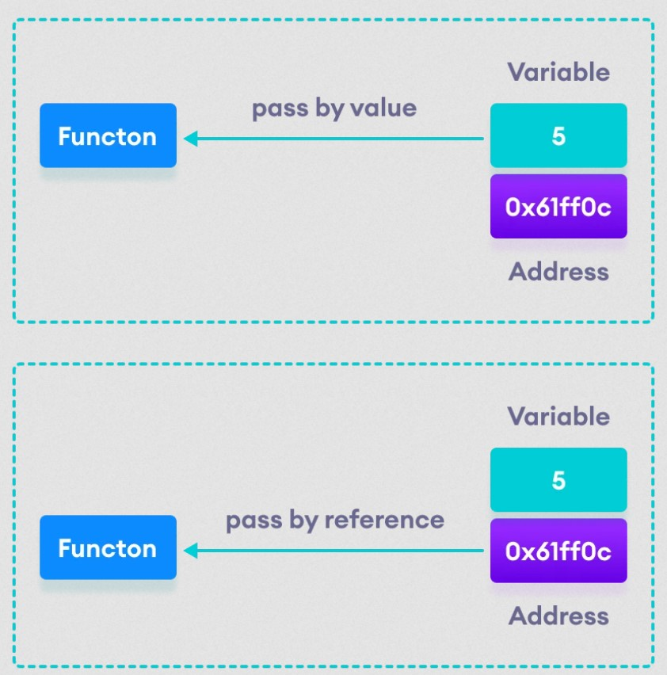

# C++ Call by reference : menggunakan pointer
##### Di tutorial, ini kita akan belajar tentang C++ Call by reference untuk memasukan pointer sebagai sebuah argument ke dalam function.
Di tutorial function C++, kita telah belajar tentang memasukan sesuatu(entah itu variabel, function atau array) ke dalam function.
Bagaimanapun juga, ada cara lain untuk memasukan suatu nilai ke dalam function dimana nilai nya kita tidak masukan ke dalam function melainkan kita memasukan alamatnya.
```
    void callByReference(int &value) {
        cout << &value << endl;
    }

    int nana = 3;
    int jade = 3;

    callByReference(nana);
    callByReference(jade);
```
Perhatikan bahwa tanda ```&``` sebelum nama parameter value, ini menandakan bahwa kita bisa memasukan alamat variabel ke parameter.

Jadi, pada saat kita memasukan nama variabel ```nana``` sebagai argument, jadi kita sebenarnya memasukan alamat variabel nana alih-alih nilai variabelnya.

##### function swap two values :
```
    swap(nana, jade);
    
    // function swap two values
    void swap(int &value1, int &value2) {
    int temp;

    // Menyimpan value2 ke variabel temp
    temp = value2;

    // Menetapkan value2 dengan value1
    value2 = value1;

    // Menetapkan value1 dengan value variabel temp
    value1 = temp;
    }
```
Disini, kita menggunakan tanda ```&``` untuk menyatakan bahwa function akan menerima alamat sebagai parameternya.


