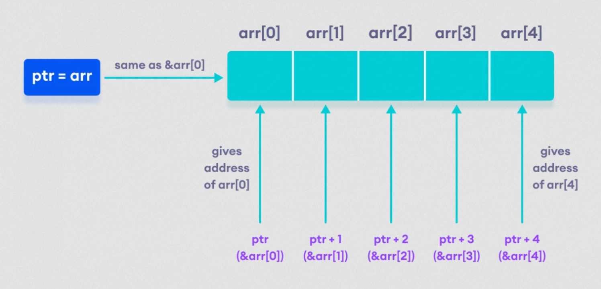

# C++ Pointer dan array
##### Di tutorial ini kita akan belajar tentang relasi antara array dan pointer.
Di C++, pointer adalah variabel yang menyimpan alamat dari variabel lain. Pointer tidak hanya bisa menampung alamat dari satu variabel, itu juga bisa menampung alamat dari cell sebuah array.

##### Menunjuk pointer ke setiap element di array
Misalkan kita ingin menunjuk element ke 5 dari array menggunakan pointer ptr.
Maka kita bisa lakukan seperti ini. Sebagai contoh :
```
// Deklarasi pointer ptr
int * ptr;

// Deklarasi array
int arr[5] = {2, 1, 9, 8, 1};

// Inisialisasi pointer ptr
ptr = arr;

// ptr + 1 sama seperti &arr[1];

// Mengakses element arr[0] dan arr[2]
   cout << *(ptr) << " " << *(ptr + 2);

// Mengakses alamat arr[0] dan arr[2]
   cout << ptr << " " << ptr + 2;

```



