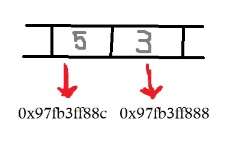
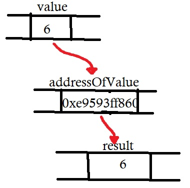

# C++ Pointers
Pada chapter sebelumnya, telah dijelaskan bahwa variabel sebagai lokasi di memori komputer yang bisa diakses dengan identifier nya(nama variabel nya).
Dengan cara ini, program kita tidak perlu mempedulikan alamat pysical dari data di memori, jadi ketika kita ingin mencetak nilai variabel, kita hanya menggunakan nama identifier setiap kita merujuk ke variabel yang ingin dicetak.

Untuk sebuah program C++, memori dari sebuah komputer seperti suksesi cell memori, masing-masing berukuran satu byte, dan masing-masing dengan alamat yang unik.
cell memori byte tunggal ini diurutkan dengan cara yang memungkinkan representasi data yang lebih besar dari satu byte untuk menempati cell memori yang memiliki alamat berurutan.

Dengan cara ini, setiap cell dapat dengan mudah ditempatkan di memori melalui alamat uniknya. Misalnya, cell memori dengan alamat 1776 selalu mengikuti segera setelah cell dengan alamat 1775 dan mendahului yang dengan 1777, dan tepat seribu cell setelah 776 dan tepat seribu cell sebelum 2776.

Ketika sebuah variabel dideklarasikan, memori harus menyimpan valuenya di lokasi yang spesifik di memori(lokasi yang spesifik adalah alamat memori). Umumnya, Program C++ tidak secara aktif menentukan alamat memori yang tepat di mana variabelnya disimpan.

### Address-of operator (&)
Alamat dari variabel bisa kita dapatkan dengan cara menambahkan ampersand (&) diawal nama variabel, yang dikenal sebagai operator-alamat, sebagai contoh :
```
    int value1 = 5;
    int value2 = 3;
    cout << &value1 << " " << &value2;
    // output : 0x97fb3ff88c 0x97fb3ff888
```

- Pertama kita insialisasi nilai value1 = 5, kemudian value2 = 3
- Kedua kita menggunakan operator-alamat untuk mengetahui alamat dari variabel value1 dan value2

Variabel yang menyimpan alamat dari variabel lain di panggil pointer. Pointer adalah fitur yang sangat kuat dari bahasa yang memiliki banyak kegunaan dalam pemrograman low level. Nanti kita akan melihat bagaimana mendeklarasikan dan menggunakan pointer.

### Deference operator (*)
Seperti yang kita lihat sebelumnya, variabel yang menyimpan alamat dari variabel lain dinamakan sebuah pointer. Pointer menunjuk ke variabel yang alamat nya mereka simpan.
Properti pointer yang menarik adalah pointer dapat digunakan untuk mengakses variabel yang ditunjuknya secara langsung. Ini dilakukan dengan mendahului nama pointer dengan operator dereference (*). Operator itu sendiri dapat dibaca sebagai "nilai yang ditunjuk oleh".
Sebagai contoh deference operator bisa digunakan untuk mengakses variabel yang ditunjuk secara langsung oleh pointer.
```
    // insialisasi value
    int value = 6;

    // deklarasi addressOfValue
    int *adressOfValue;

    // inisilisasi addressOfValue
    adressOfValue = &value;

    // inisialisasi result
    int result = *adressOfValue;

    // mencetak result dan alamat value
    cout << result << " : " << adressOfValue;
```
Disini :
-```&value``` dibaca sebagai alamat dari variabel value
-```*adressOfValue``` bisaa dibaca sebagai value yang ditunjuk oleh alamat variabel value


### Deklarasi pointer
Karena kemampuan pointer untuk secara langsung merujuk ke nilai yang ditunjuknya, pointer memiliki properti yang berbeda saat menunjuk ke char daripada saat menunjuk ke int atau float. Setelah direferensikan, jenisnya perlu diketahui. Dan untuk itu, deklarasi pointer perlu menyertakan tipe data yang akan ditunjuk pointer.
Cara deklarasi pointer :
```type * pointerName; ```
di mana ```type``` adalah tipe data yang ditunjuk oleh pointer. Tipe ini bukan tipe pointer itu sendiri, tetapi tipe data yang ditunjuk pointer. Sebagai contoh:
```
int * pointerValue1;
int * pointerValue2;
int * pointerValue3;
```
Disini kita tidak bisa menyimpan alamat variabel dengan tipe data yang berbeda, sebagai contoh :
```
// inisialisasi salary
float salary = 4.000;

// inisilisasi pointer
int * pointer = &salary; // error
```

Perhatikan bahwa tanda asterisk (```*```) yang digunakan saat mendeklarasikan pointer hanya berarti pointer (ini adalah bagian dari tipe compound specifier), dan jangan disamakan dengan operator dereference ```*pointerName;```, tetapi juga ditulis dengan tanda bintang (```*```). Mereka adalah dua hal berbeda yang diwakili dengan tanda yang sama yaitu (```*```).

Mari kita lihat contoh pada pointer:
```
// Mendeklarasikan pointer
int * pointer;

// Assign value ke pointer
*pointer = 3;

// Mengakses value pointer
cout << *pointer;
```

### Inisisialisasi pointer
Pointer bisa di inisialisasikan ke lokasi tertentu pada saat mereka didefinisikan, Sebagai contoh :
```
// Inisialisasi value
float value = 3.200;

// Inisialisasi myPointer
int * myPointer = &value;
```
