# C++ structure and function
##### Pada tutorial ini, kita akan belajar bagaimana cara memasukan struktur sebagai sebuah argument ke dalam function, dan menggunakannya di program kita.
variabel struktur bisa dimasukan ke dalam function dan di return.
Pada program ini kita telah membuat program berikut :

Kita membuat variabel Mirai struktur dari structure Person, kemudian kita memberi nilai pada setiap membernya. Dan kita memanggil function printPersonStruct dan mengisi argumentnya dengan nama variabel struktur Mirai, setelah itu Mirai bisa diakses oleh function tersebut.