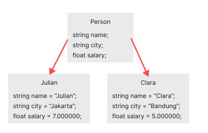
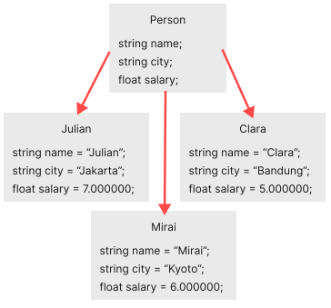
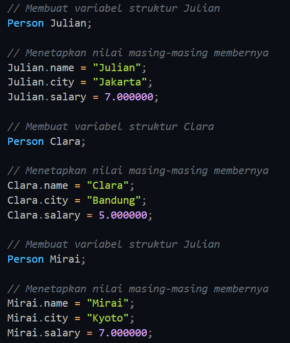

# C++ Structures
##### Pada artikel ini, kamu akan belajar tentang structures di pemrograman C++: apa itu structures dan bagaimana cara menggunakannya di program kita.

Structure adalah sebuah koleksi dari variable yang tipe datanya berbeda-beda. Mirip seperti sebuah class yang menampung kumpulan data yang tipe datanya berbeda-beda.

**Sebagai contoh : ** Kita ingin menyimpan beberapa informasi tentang seseorang yang mana terdapat: namanya, kewarganegaraan dan gajinya. Misal kita bisa membuat variabel-variabelnya dengan mudah yaitu ```name, city, salary```.
```
// informasi Julian
string name = "Julian";
string city = "Jakarta";
float salary = 7.000000;
```

Bagaimanapun juga, kedepannya, kalau kita akan menyimpan informasi lebih dari satu orang. Sekarang, kita harus membuat variabel informasi yang berbeda-beda untuk setiap orang:
```
// informasi Julian
string name1 = "Julian";
string city1 = "Jakarta";
float salary1 = 7.000000;

// informasi Clara
string name2 = "Clara";
string city2 = "Bandung";
float salary2 = 5.000000;

// informasi McKotril
string name3 = "McKotril"
string city3 = "Jakarta";
float salary3 = 6.000000;
```
Coba deh bayangin berapa banyak variabel yang harus kita buat untuk masing-masing orang dan pastinya kode program kita terlihat berantakan. Juga tidak ada relasi antara variabel-variabel(informasi).

Cara yang lebih baik adalah membuat blueprint untuk semua informasi yaitu namanya struktur, jadi kita kalau mau membuat informasi untuk setiap orang, kita bisa membuatnya menggunakan ```Person```. Dan ini membuat kode program kita lebih bersih dan mudah dibaca dan juga efisien.

Jadi nanti kumpulan semua informasi seperti ```name, city, salary``` adalah bagian dari struktur Person.

### Bagaimana cara mendeklarasikan sebuah struktur di pemrograman C++
Kata kunci ```struct``` mendefinisikan sebuah struktur yang di ikuti dengan identfier (nama dari struktur).
Kemudian di dalam kurung kurawal, kita bisa mendeklarasikan satu atau lebih dari satu member (member adalah deklarasi variabel didalam kurung kurawal) struktur. Sebagai contoh:
```
struct Person
{
    // three members
    string name;
    string city;
    float salary;
};
```
Disini adalah struktur yang didefinsikan dengan nama ```Person``` yang mana mempunyai 3 anggota(member): ```name```, ```city``` dan ```salary```.

Ketika sebuah struktur dibuat, tidak ada memori yang dialokasikan.

### Bagaimana cara untuk mendefinisikan variabel struktur dari sebuah struktur?
Setelah kita mendeklarasikan struktur Person seperti diatas. Kita bisa mendefinisikan variabel struktur dari sebuah struktur seperti ini:
```
Person Julian;
```
Artinya kita telah membuat variabel struktur dari struktur Person.
Disini, sebuah variabel struktur Julian didefinisikan dari struktur Person.
Ketika variabel struktur di definisikan, kemudian memori yang di butuhkan di alokasikan oleh compiler.


# Bagaimana cara mengakses member dari struktur?
Member dari variabel struktur di akses menggunakan operator titik(.).
Misal, Kita ingin mengakses ```name``` dari variabel struktur Julian atau memasukan nilai kedalamnya. Kita melakukannya dengan cara:
```
// Mengakses member struktur variabel Julian
Julian.name;

// Memasukan nilai kedalam member struktur variabel Julian
Julian.salary = 7.000000;
```




